  

<h3 align="center">🔐 Cybersecurity &nbsp;·&nbsp; 🌐 Networks & Cloud &nbsp;·&nbsp; 💻 Full-Stack Dev</h3>

  
  

---

## 👨‍💻 About

Networks & cybersecurity student. I spend most of my time on three things: hardening infrastructure, building web apps, and automating systems at home and in the cloud. A lot of my projects sit in the overlap between security, networking, and software, which is exactly where I like to work.

I learn by building. If I want to understand a protocol or a tool, I'll usually stand it up in a lab, break it on purpose, and figure out how to defend it.

---

## 🛠️ Tech Stack

**Security**

**Networking**

**Development**

**Cloud & DevOps**

---

## 🎯 What I'm Working On

- **Infrastructure security** — intrusion detection, monitoring, and vulnerability assessment in lab environments
- **IoT & home automation** — wireless protocols, smart-building setups, and local-first tooling
- **Full-stack web** — small apps and tools, usually self-hosted
- **CTF & hands-on security** — picking up techniques by attacking and defending my own setups

---

## 📊 GitHub Stats

 

---

  <i>Open to opportunities in networks & cybersecurity.</i>

